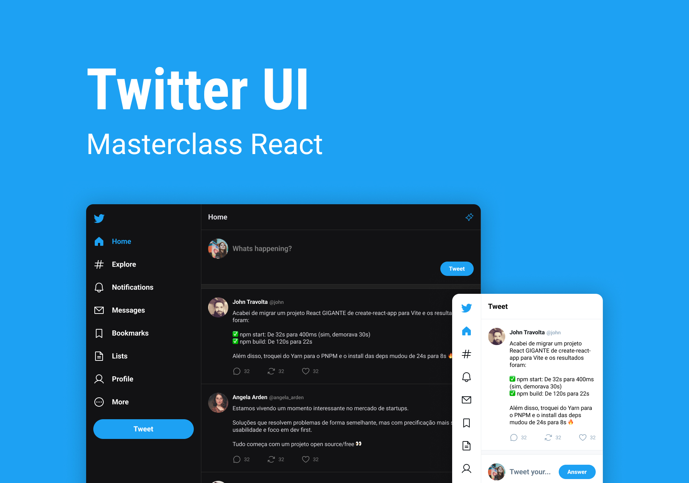

<h1 align="center"> Clone do Twitter </h1>

<a href="https://www.rocketseat.com.br/boracodar">#masterclass</a> evento único para conhecimento do React, promovido pela Rocketseat.  

  <a href="#-tecnologias">Tecnologias</a>&nbsp;&nbsp;&nbsp;|&nbsp;&nbsp;&nbsp;
  <a href="#-layout">Layout</a>&nbsp;&nbsp;&nbsp;|&nbsp;&nbsp;&nbsp;
  <a href="#memo-licença">Licença</a>

  

 

  

## 🚀 Tecnologias

Esse projeto foi desenvolvido com as seguintes tecnologias:

- HTML e CSS
- JavaScript e DOM
- TypeScript
- React.js
- Node.js
- Figma
- Git e GitHub

---
## 💻 Projeto

O CloneTwitter, nada mais é que, um pequeno clone da interface do Twitter, para a prática em React.js proposta pela Rocketseat no evento da Masterclass .

- [Visite o projeto online](https://sanchesvitor.github.io/CloneTwitter/)

---

## 📚 Um poudo do que vimos nesse projeto

- propriedades CSS `flex`, `grid-layout`
- responsividade
- Javascript: variáveis, estrutura de repetição, condicionais (if/else) e ternários
- React: `FormEvent`, `useState`, `KeyboardEvent`, `Components`
- TypeScript: `interface`

---

## 🛠 Bibliotecas e Dependencias

- [Vite - Iniciando o projeto](https://vitejs.dev/)
- [Phosphor-React - Icons Utilizados](https://phosphoricons.com/)
- [React Router - Para criação de rotas](https://reactrouter.com/en/main)
---

## 🔖 Layout

Você pode visualizar o layout do projeto através [DESSE LINK](https://www.figma.com/community/file/1202694130789327431). É necessário ter conta no [Figma](https://figma.com) para acessá-lo.

## :memo: Licença

Esse projeto está sob a licença MIT.

---

 

